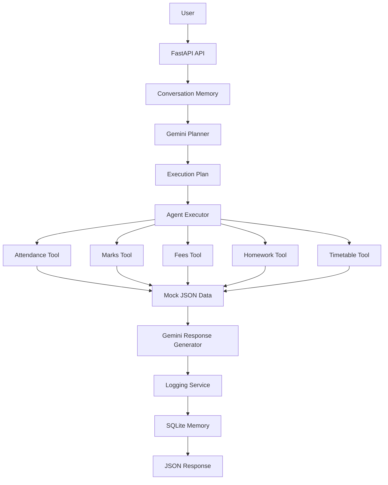

# 🏗️ Architecture

## Overview

The **School AI ERP Assistant** is an Agentic AI application that enables students, teachers, and parents to interact with a School ERP system using natural language.

Instead of relying on hardcoded keyword matching, the application uses **Google Gemini** to understand the user's intent, create an execution plan, select the appropriate ERP tools, retrieve relevant data, and generate a structured response.

The application follows a modular architecture based on **FastAPI**, making it scalable, maintainable, and easy to extend.

---

# System Architecture



---

# High-Level Architecture

```text
                    +-----------------------+
                    |       User            |
                    +-----------+-----------+
                                |
                                |
                     POST /api/v1/chat
                                |
                                v
                    +-----------------------+
                    |      FastAPI API      |
                    +-----------+-----------+
                                |
                                |
                                v
                    +-----------------------+
                    | Conversation Memory   |
                    +-----------+-----------+
                                |
                                |
                                v
                    +-----------------------+
                    |   Gemini Planner      |
                    +-----------+-----------+
                                |
                Generates Execution Plan
                                |
                                v
                    +-----------------------+
                    |    Agent Executor     |
                    +-----------+-----------+
                                |
      ---------------------------------------------------------
      |            |             |             |              |
      v            v             v             v              v
 Attendance     Marks         Fees       Homework      Timetable
    Tool         Tool          Tool         Tool           Tool
      \            |             |             |            /
       \           |             |             |           /
        \----------+-------------+-------------+----------/
                                |
                                v
                    +-----------------------+
                    | Mock JSON Database    |
                    +-----------+-----------+
                                |
                                v
                    +-----------------------+
                    | Gemini Response       |
                    | Generator             |
                    +-----------+-----------+
                                |
                                v
                    +-----------------------+
                    | Logging + SQLite      |
                    +-----------+-----------+
                                |
                                v
                    +-----------------------+
                    | JSON Response         |
                    +-----------------------+
```

---

# Request Lifecycle

1. User sends a natural language query.
2. FastAPI receives the request.
3. Previous conversation is loaded from SQLite.
4. Gemini analyzes the query.
5. Gemini generates an execution plan.
6. Agent Executor selects the required ERP tools.
7. Tool(s) retrieve data from JSON.
8. Gemini generates the final response.
9. Interaction is stored in logs.
10. Conversation is saved in SQLite.
11. Structured JSON response is returned.

---

# AI Planning Workflow

```
User Query
      │
      ▼
Gemini Intent Detection
      │
      ▼
Execution Plan Generation
      │
      ▼
Tool Selection
      │
      ▼
Tool Execution
      │
      ▼
Response Generation
```

---

# Agent Execution Flow

```
Natural Language Query
          │
          ▼
Conversation Memory
          │
          ▼
Gemini Planner
          │
          ▼
Execution Plan
          │
          ▼
Agent Executor
          │
          ▼
ERP Tool(s)
          │
          ▼
Gemini Response
          │
          ▼
Save Memory
          │
          ▼
Return JSON
```

---

# Conversation Memory

The application stores conversation history using **SQLite**.

Memory enables follow-up questions without repeating context.

Example:

```
User:
Show my marks.

↓

Assistant:
Displays marks.

↓

User:
Which subject has the highest score?

↓

The assistant understands that
the question refers to marks.
```

---

# ERP Tool Layer

The application contains five independent tools.

| Tool | Purpose |
|------|---------|
| Attendance Tool | Attendance percentage, missed classes |
| Marks Tool | Subject-wise marks and averages |
| Fees Tool | Fee status and payment history |
| Homework Tool | Pending and upcoming assignments |
| Timetable Tool | Daily and weekly timetable |

Each tool reads data from the corresponding JSON file inside the **mock_data** directory.

---

# Logging Flow

Every interaction records:

- Timestamp
- User Query
- Detected Intent
- Execution Plan
- Selected Tool(s)
- Execution Time
- Response
- Status

Logs are stored in:

```
logs/agent_logs.json
```

---

# Folder Responsibilities

| Folder | Responsibility |
|---------|----------------|
| api | FastAPI endpoints |
| agents | Planning and execution logic |
| services | Gemini, logging, history services |
| tools | ERP business logic |
| memory | SQLite conversation memory |
| models | Pydantic schemas |
| utils | Prompt templates |
| mock_data | ERP JSON data |
| logs | Agent logs |
| tests | Unit and integration tests |

---

# Design Decisions

### Agentic AI

Uses Gemini to plan execution instead of hardcoded routing.

---

### Modular Architecture

Each component has a single responsibility, making the project scalable and maintainable.

---

### SQLite Memory

Lightweight, persistent storage for multi-turn conversations without external dependencies.

---

### JSON Mock Data

Simple, portable, and ideal for demonstrating ERP functionality without requiring a real database.

---

### FastAPI

Provides automatic Swagger documentation, request validation, and high-performance asynchronous APIs.

---

### Docker Support

Allows consistent deployment across local and cloud environments.

---

# Technologies

- Python 3.11
- FastAPI
- Google Gemini 2.0 Flash
- google-generativeai
- SQLite
- JSON
- Pydantic
- Pytest
- Docker

---

# Future Enhancements

- Authentication & Authorization (JWT)
- PostgreSQL Integration
- Role-Based Access Control
- OCR Document Processing
- Voice Assistant
- Email & SMS Notifications
- Multi-language Support
- Real School ERP Integration

---

## Conclusion

The School AI ERP Assistant demonstrates a complete **Agentic AI architecture** by combining natural language understanding, execution planning, autonomous tool selection, conversation memory, structured logging, and modular API design. The project showcases clean software architecture while remaining easy to extend for real-world educational ERP systems.